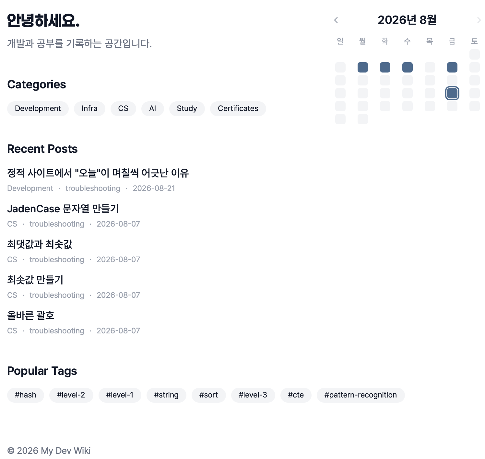

<div align="center">

# 📚 dev-archive

**몇 년 뒤에도 다시 찾아볼 수 있는 개발 지식 저장소**

[](https://astro.build)
[](https://tailwindcss.com)
[](https://pages.github.com)
[](https://github.com/sssuunnnm/dev-archive/actions/workflows/deploy.yml)
[](https://github.com/sssuunnnm/dev-archive/commits/main)

[](https://sssuunnnm.github.io/dev-archive/)

</div>

---

## 🖼 미리보기

<div align="center">

</div>

---

## 🧭 소개

블로그처럼 최신 글이 위에 쌓이는 구조보다, 필요한 내용을 **카테고리 · 기술 · 태그**로 바로 찾아볼 수 있는 위키에 가까운 형태를 목표로 합니다.

> 글을 많이 쓰는 것보다, 다시 찾기 쉬운 구조를 만드는 데 집중한다.

폴더 구조는 최대한 단순하게 유지하고, 분류는 아래 3가지 메타데이터로만 관리합니다.

| 메타데이터 | 의미 |
| :---: | :--- |
| `category` | 이 글의 **목적** (development, infra, cs, ai, study, certificates) |
| `technology` | 사용한 **기술** (spring, docker, redis 등) |
| `tags` | 다루는 **주제/개념** (jwt, caching, ci-cd 등) |

순서가 없는 콘텐츠(코딩테스트 문제 등)는 `series` 대신 `tags: [주제, level-N]` 조합으로 묶고, Related Posts 자동 추천이 알아서 연결해줍니다.

---

## ✨ 주요 기능

| 기능 | 설명 |
| --- | --- |
| 4개 콘텐츠 타입 | Articles(일반 글) · Projects(프로젝트 허브) · References(계속 갱신되는 참고 문서) · Snippets(30초 조회용 명령어/코드) |
| Category / Tag 정적 페이지 | 카테고리·태그별로 진짜 정적 페이지가 빌드 타임에 생성됨 |
| Related Posts 자동 추천 | category·technology·tags 겹침 기반 점수로 관련 글 자동 노출 (수동 `related` 지정도 가능) |
| Project ↔ Article 양방향 연결 | `projects` 필드 하나로 프로젝트 페이지 ↔ 관련 글이 서로 자동 연결 |
| Archive vs Portfolio 패턴 | 기술 디테일이 방대한 프로젝트는 `{slug}-archive`(비공개 원본)와 `{slug}`(공개용 정리본)로 분리 |
| 검색 | [Pagefind](https://pagefind.app) 기반 전문(full-text) 검색 |
| 다크모드 | 시스템 설정 감지 + 수동 토글, `localStorage`에 저장 |
| SEO | Sitemap, RSS, canonical/OG/Twitter Card 메타태그 자동 생성, Google Search Console 연동 |
| 방문자 분석 | [GoatCounter](https://goatcounter.com) 연동 (선택, 무료) |
| draft 워크플로우 | `draft: true`는 `npm run dev`에서만 보이고 배포에서는 제외 |

---

## 🛠 기술 스택

<div align="center">

</div>

| 분류 | 사용 기술 |
| --- | --- |
| 프레임워크 | [Astro](https://astro.build) |
| 스타일링 | [Tailwind CSS](https://tailwindcss.com) (+ Typography 플러그인), [Pretendard](https://github.com/orioncactus/pretendard) |
| 아이콘 | [Lucide](https://lucide.dev) (`@lucide/astro`) |
| 검색 | [Pagefind](https://pagefind.app) |
| 배포 | [GitHub Pages](https://pages.github.com) + [GitHub Actions](https://github.com/features/actions) |
| 코드 리뷰 | [CodeRabbit](https://coderabbit.ai) |

---

<details>
<summary><h2 style="display: inline;">📂 폴더 구조</h2></summary>

```
src/
├── content/
│   ├── articles/       # 일반 글 (study, tutorial, troubleshooting, review, tips)
│   ├── projects/       # 프로젝트 허브 페이지
│   ├── references/     # 계속 갱신되는 참고 문서
│   └── snippets/       # 짧은 코드/명령어 조각
├── content.config.ts   # Content Collections 스키마 (Technology Dictionary 포함)
├── lib/                # 카테고리 목록, 관련 글 추천, draft 노출 여부 등 공용 모듈
├── layouts/            # BaseLayout, ArticleLayout
├── components/         # Breadcrumb, MiniCalendar, Search 등 재사용 컴포넌트
└── pages/              # 실제 라우팅되는 페이지

templates/               # 새 글/프로젝트/레퍼런스/스니펫 작성 시 복사해서 쓰는 frontmatter 템플릿
```

> 글 폴더는 `category`별로 나누지 않고 **평평하게(flat)** 유지합니다. 분류는 오직 frontmatter 메타데이터로만 처리합니다.

</details>

---

<details>
<summary><h2 style="display: inline;">📈 SEO / 방문자 분석 설정</h2></summary>

Google Search Console(검색 유입 분석)과 GoatCounter(방문자 분석) 연동을 지원합니다. 둘 다 선택 사항이며, 값을 설정하지 않으면 관련 스크립트/메타태그는 렌더링되지 않습니다.

가입 방법과 값 확인 방법은 `.env.example` 주석을 참고해 값을 채운 뒤, 로컬 테스트용으로 `.env`에 복사하세요. 배포에 반영하려면 GitHub repo → **Settings → Secrets and variables → Actions → Variables** 탭에 동일한 이름(`PUBLIC_GOOGLE_SITE_VERIFICATION`, `PUBLIC_GOATCOUNTER_CODE`)으로 등록하면 다음 배포부터 자동 반영됩니다.

</details>
