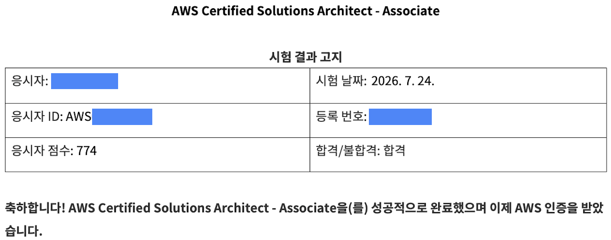
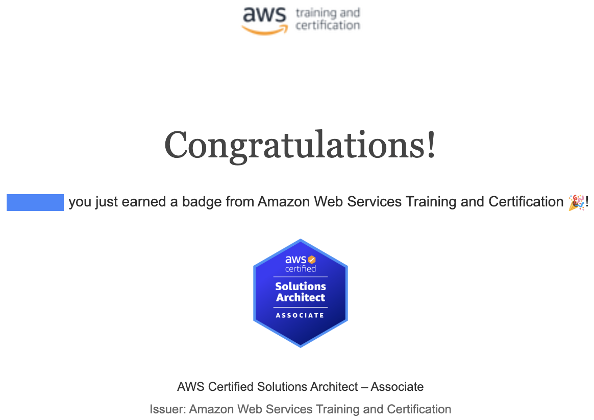

## 한 줄 요약

약 **2주 동안 강의 하나만 중심으로 준비해 AWS SAA-C03 시험에서 774점으로 합격**했다.

EC2를 제외하면 AWS 경험이 거의 없는 상태였지만, 핵심 개념과 문제를 반복 학습하는 방식으로 단기간에 합격할 수 있었다.

| 항목 | 내용 |
| --- | --- |
| 결과 | ✅ PASS (774 / 1000) |
| 합격 기준 | 720점 |
| 준비 기간 | 약 2주 |
| 사전 지식 | EC2 사용 경험 외 거의 없음 |
| 공부 자료 | 인프런 「AWS SAA-C03 자격증 벼락치기 - 딱 163문제로 2주만에 합격하기」 |
| 추가 교재 | 없음 |

> 📩 **합격 메일**

---

## 왜 시작했는가

하반기 공채가 시작되기 전에 빠르게 취득할 수 있는 자격증이 하나 필요했다.

정보처리기사는 당시 일정상 준비하더라도 하반기 채용에서 활용하기 어려웠고, 채용 공고를 살펴보니 AWS SAA 자격증을 우대하거나 클라우드 역량을 요구하는 기업들이 종종 있었다.

마침 인프라와 클라우드에도 관심이 있었기 때문에 짧은 기간 안에 준비할 수 있는 AWS SAA-C03를 목표로 공부를 시작했다.

---

## 사전 지식

AWS를 처음부터 공부한 것은 아니지만 경험이 많지도 않았다.

프로젝트에서 EC2를 사용해본 경험은 있었지만, S3는 이름만 들어본 정도였고 그 외 서비스는 거의 모르는 상태에서 시작했다.

즉, AWS 서비스를 실제로 운영하거나 다양한 서비스를 사용해본 경험은 거의 없는 상태였다.

---

## 공부 기간

- **7월 9일** : 개념 강의 시작
- **7월 16일** : 강의 완강
- **7월 24일** : 시험 응시

실제로는 약 2주 정도 준비했고, 다른 일정도 함께 진행하고 있었기 때문에 하루 종일 공부만 하지는 않았다.

---

## 공부 방법

이번 시험에서는 인프런의 **「AWS SAA-C03 자격증 벼락치기 - 딱 163문제로 2주만에 합격하기」** 강의를 중심으로 공부했다.

다른 일정도 있었기 때문에 매일 공부하지는 못했고, 공부하는 날에는 하루에 **강의 1~2섹션(약 1시간 분량)을 1.5배속**으로 들으며 진도를 나갔다.

개념은 강의에서 제공하는 내용만 학습했고, 이해가 부족한 부분만 간단히 필기하며 정리했다.

강의를 모두 수강한 뒤에는 제공되는 문제를 약 **1.5회독** 정도 풀었다.

초반에는 **Cloud Pass** 앱도 함께 활용해볼까 고민했지만, 중간에 유료화되면서

- 강의
- 앱
- 시험 응시료

까지 결제하는 것은 부담스럽다고 판단해 강의 외 추가 지출은 하지 않았다.

시험 전날에는 강의 마지막에 제공되는 **모의문제 약 100문제**를 풀며 마무리했다.

해설이 없는 문제는 AI에게 질문하면서 풀이를 확인했고, 결과적으로는 **강의에서 제공되는 내용만으로도 충분히 합격할 수 있었다.**

---

## 시험 후기

이번 시험은 **온라인(OnVUE)** 으로 응시했다.

가까운 시험장이 있기는 했지만 원하는 날짜와 시간에 예약이 어려워 비대면 시험을 선택했다.

온라인 시험을 준비한다면 아래 사항을 미리 확인하는 것을 추천한다.

- 독립된 공간 준비
- 여권(또는 규정에 맞는 신분증) 준비
- 시험 시작 전 웹캠으로 시험 공간 촬영

또 하나 알아두면 좋은 점은 영어가 모국어가 아닌 응시자는 시험 시간을 **30분 추가**로 받을 수 있다는 것이다.

신청하면 기본 130분에 30분이 추가되어 총 **160분** 동안 시험을 볼 수 있지만, 개인적으로는 기본 130분으로도 크게 부족하지 않았다.

추가 시간을 받고 싶다면 시험 접수 전에 미리 신청해야 한다.

> 📊 **시험 결과**

---

## 합격 후기

시험을 보는 동안에는 생각보다 확신이 들지 않았다.

문제를 풀 때마다 '이게 맞나?' 싶은 문제가 꽤 많아서 떨어질 수도 있겠다는 생각이 들었는데, 다행히 **774점**으로 합격할 수 있었다.

공부하면서 가장 도움이 되었던 것은 모든 서비스를 암기하려고 하기보다 **헷갈리는 서비스들의 차이점을 비교하며 정리하는 것**이었다.

실제 시험에서는 선택지의 키워드 한두 개만 바뀌는 경우가 많아 서비스 간 특징을 정확히 구분하는 것이 중요하다고 느꼈다.

또 시험은 웹 환경에서 진행되기 때문에 종이에 문제를 푸는 것과는 조금 다르다.

가능하다면 모의문제 사이트처럼 웹에서 문제를 푸는 환경에 익숙해지는 것도 도움이 될 것 같다.

합격 결과는 사람마다 차이가 있는 것 같다.

후기를 찾아보면 4~5시간 만에 결과를 받은 경우도 있었지만, 나는 약 **8시간 정도** 지나서 결과를 확인할 수 있었다.

---

## 마무리

AWS 경험이 거의 없는 상태에서 시작했지만, 핵심 개념과 문제를 반복 학습하는 방식으로 약 2주 만에 합격할 수 있었다.

클라우드를 처음 공부하거나 취업 준비를 위해 단기간에 SAA를 취득해야 한다면, 여러 교재를 병행하기보다 하나의 강의를 끝까지 반복하는 방법도 충분히 좋은 선택이라고 생각한다.

물론 이 글은 어디까지나 내가 준비했던 방법을 기록한 후기다. 사람마다 배경지식과 공부 스타일이 다르기 때문에 참고용으로 활용하면 좋겠다.