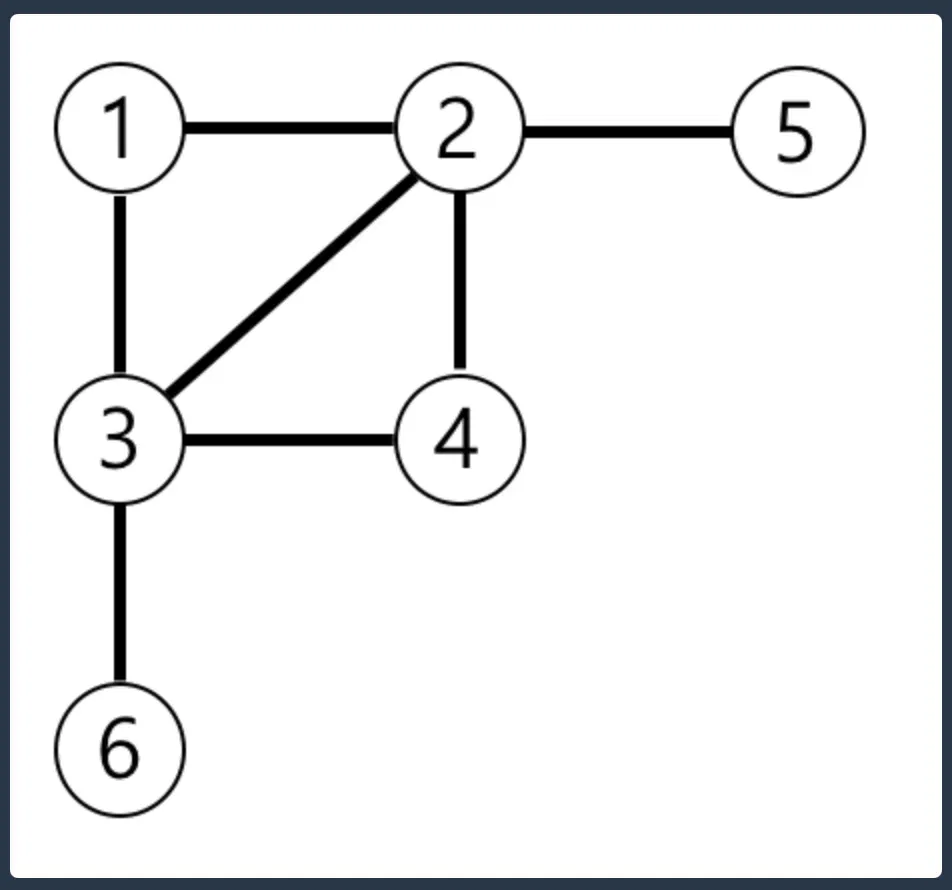

## 한 줄 요약

그래프 문제가 어려운 건 그래프 자체가 어려워서가 아니라, "그림"을 "코드로 표현하는 방법"이 손에 안 익어서인 경우가 대부분이다.

## 왜 (배경/문제 상황)

그래프 문제를 보면 그림은 이해가 되는데 막상 코드로 옮기려면 막막해지는 경우가 많다. 그 이유는 두 단계가 섞여 있기 때문이다.

1. 그림(노드/간선)을 어떤 자료구조로 옮길 것인가 (인접리스트/인접행렬)
2. 옮긴 자료구조를 어떤 순서로 탐색할 것인가 (DFS/BFS)

이 두 단계를 나눠서 보면 훨씬 단순해진다.

## 본문

### 기본 용어

- **정점(Vertex, 노드)**: 그래프를 이루는 하나의 점. 사람, 위치, 컴퓨터 등 뭐든 될 수 있다.
- **간선(Edge)**: 정점과 정점을 잇는 선. 관계나 경로를 의미한다.
- **방향 그래프 vs 무방향 그래프**: 간선에 방향이 있으면(A→B만 가능) 방향 그래프, 양쪽 다 가능하면 무방향 그래프.
- **가중치(Weight)**: 간선을 지나는 데 드는 비용. 프로그래머스 레벨 0~2 범위에서는 가중치 없는(전부 비용 1) 그래프가 대부분이다.

### 그래프를 코드로 표현하기: 인접리스트

아래 그래프를 예로 든다.



**노드**: 1, 2, 3, 4, 5, 6
**간선**: (1-2), (1-3), (2-3), (2-4), (2-5), (3-4), (3-6)

이걸 코드로 옮기면 "각 노드가 어떤 노드들과 연결돼 있는지"를 배열로 나열하면 된다. 이게 **인접리스트**다.

```cpp
vector<vector<int>> graph(7); // 인덱스 0은 안 쓰고 1~6만 사용

// 무방향 그래프이므로 양쪽에 다 넣어준다
graph[1].push_back(2); graph[2].push_back(1);
graph[1].push_back(3); graph[3].push_back(1);
graph[2].push_back(3); graph[3].push_back(2);
graph[2].push_back(4); graph[4].push_back(2);
graph[2].push_back(5); graph[5].push_back(2);
graph[3].push_back(4); graph[4].push_back(3);
graph[3].push_back(6); graph[6].push_back(3);
```

`graph[2]`를 출력하면 `[1, 3, 4, 5]`가 나온다. "2번 노드는 1, 3, 4, 5번 노드와 연결돼 있다"는 뜻이다. 이 형태만 만들 수 있으면 절반은 끝난 거다.

### DFS vs BFS

그래프를 만들었으면 이제 "어떤 순서로 방문할 것인가"를 정해야 한다.

- **DFS(깊이우선탐색)**: 한 방향으로 갈 수 있는 데까지 계속 파고들다가, 막히면 되돌아온다. 재귀 또는 스택으로 구현.
- **BFS(너비우선탐색)**: 가까운 노드부터 한 단계씩 넓게 퍼져나간다. 큐로 구현.

**둘의 결정적 차이**: 가중치가 없는 그래프에서 "최단거리"를 구해야 하면 반드시 BFS를 써야 한다. DFS는 방문 순서가 최단경로를 보장하지 않는다.

```cpp
// DFS (재귀)
vector<bool> visited(7, false);
void dfs(int node, vector<vector<int>>& graph) {
    visited[node] = true;
    for (int next : graph[node]) {
        if (!visited[next]) {
            dfs(next, graph);
        }
    }
}
```

```cpp
// BFS (큐)
void bfs(int start, vector<vector<int>>& graph) {
    vector<bool> visited(7, false);
    queue<int> q;
    q.push(start);
    visited[start] = true;

    while (!q.empty()) {
        int cur = q.front(); q.pop();
        for (int next : graph[cur]) {
            if (!visited[next]) {
                visited[next] = true;
                q.push(next);
            }
        }
    }
}
```

### 프로그래머스에서 자주 나오는 패턴 2가지

**패턴 1. 연결된 그룹 개수 세기 (네트워크형)**

컴퓨터 네트워크처럼 "몇 개의 컴퓨터가 서로 연결돼 있나"를 묻는 문제. 전체 노드를 순회하면서, 아직 방문 안 한 노드를 발견할 때마다 DFS/BFS 한 번씩 돌리고 카운트를 올리면 된다.

```cpp
int countNetworks(int n, vector<vector<int>>& graph) {
    vector<bool> visited(n, false);
    int count = 0;
    for (int i = 0; i < n; i++) {
        if (!visited[i]) {
            // 여기서 dfs(i) 또는 bfs(i) 호출 (visited 갱신)
            count++;
        }
    }
    return count;
}
```

**패턴 2. 격자(2차원 배열)에서 최단거리 구하기**

"게임 맵에서 목표까지 최단 이동 횟수" 같은 문제. 격자 자체를 그래프로 본다 — 각 칸이 노드, 상하좌우로 이동 가능하면 간선이 있는 셈이다. 벽(막힌 칸)은 간선이 없는 것과 같다. 최단거리이므로 BFS를 쓴다.

```cpp
int bfsGrid(vector<vector<int>>& board, int n, int m) {
    vector<vector<bool>> visited(n, vector<bool>(m, false));
    vector<vector<int>> dist(n, vector<int>(m, 0));
    queue<pair<int,int>> q;

    q.push({0, 0});
    visited[0][0] = true;
    dist[0][0] = 1; // 시작 칸도 1칸으로 세는 규칙이면 1부터

    int dx[] = {-1, 1, 0, 0};
    int dy[] = {0, 0, -1, 1};

    while (!q.empty()) {
        auto [x, y] = q.front(); q.pop();
        for (int d = 0; d < 4; d++) {
            int nx = x + dx[d], ny = y + dy[d];
            if (nx < 0 || nx >= n || ny < 0 || ny >= m) continue; // 맵 밖
            if (board[nx][ny] == 0) continue; // 벽
            if (visited[nx][ny]) continue;

            visited[nx][ny] = true;
            dist[nx][ny] = dist[x][y] + 1;
            q.push({nx, ny});
        }
    }

    return dist[n-1][m-1]; // 도착 못하면 0으로 남음 -> 문제 조건에 맞게 -1 처리
}
```

이 패턴은 "그래프"라는 말이 문제에 없어도, 격자 이동/최단거리라는 단어만 보이면 바로 BFS부터 떠올리면 된다.

### 직접 눌러보기 — 격자에서 BFS가 퍼져나가는 과정

왼쪽 위(파란 칸)에서 시작해 오른쪽 아래(초록 테두리 칸)까지, 검은 칸(벽)을 피해 BFS가 한 단계씩 퍼져나가는 걸 재생한다. 숫자는 시작 칸으로부터의 거리(`dist`)다.

<div class="bfsdemo">
<style>
.bfsdemo {
  --ink: #1c1917; --sub: #6b7280; --line: #e5e7eb; --card: #fafafa; --card2: #f4f4f5;
  --accent: #466b8f; --good: #16a34a; --wall: #44403c;
  font-family: 'Pretendard', system-ui, sans-serif; font-size: 14px; line-height: 1.6; color: var(--ink);
  border: 1px solid var(--line); border-radius: 16px; padding: 20px; background: var(--card); margin: 24px 0;
}
.dark .bfsdemo { --ink: #e5e7eb; --sub: #9ca3af; --line: #374151; --card: #18181b; --card2: #27272a; --accent: #8fadc7; --wall: #0a0a0a; }
.bfsdemo .grid { display: grid; grid-template-columns: repeat(5, 44px); gap: 5px; margin-bottom: 12px; justify-content: center; }
.bfsdemo .cell {
  width: 44px; height: 44px; display: flex; align-items: center; justify-content: center;
  border-radius: 6px; background: var(--card2); border: 2px solid var(--line);
  font-family: 'Fira Code', monospace; font-weight: 700; font-size: 13px; transition: all .2s;
}
.bfsdemo .cell.wall { background: var(--wall); border-color: var(--wall); }
.bfsdemo .cell.frontier { border-color: var(--accent); background: color-mix(in srgb, var(--accent) 25%, var(--card2)); }
.bfsdemo .cell.visited { color: var(--sub); }
.bfsdemo .cell.start { border-color: var(--accent); background: color-mix(in srgb, var(--accent) 35%, var(--card2)); }
.bfsdemo .cell.end { border-color: var(--good); }
.bfsdemo .narr { min-height: 22px; font-size: 12.5px; color: var(--sub); margin-bottom: 12px; text-align: center; }
.bfsdemo .narr b { color: var(--ink); font-family: 'Fira Code', monospace; }
.bfsdemo .controls { display: flex; gap: 10px; justify-content: center; }
.bfsdemo .btn { background: var(--ink); color: var(--card); border: 0; border-radius: 8px; padding: 9px 16px; font-family: inherit; font-weight: 700; font-size: 13px; cursor: pointer; }
.bfsdemo .btn:disabled { opacity: .5; cursor: not-allowed; }
</style>

<div class="grid" id="bfs_grid"></div>
<div class="narr" id="bfs_narr">재생 버튼을 누르면 큐에서 하나씩 꺼내 상하좌우를 확인합니다.</div>
<div class="controls"><button class="btn" id="bfs_play">▶ 처음부터 재생</button></div>
</div>

<script>
(function () {
  const root = document.currentScript.previousElementSibling;
  if (!root || !root.classList.contains('bfsdemo')) return;
  const BOARD = [
    [1, 1, 1, 1, 1],
    [0, 0, 0, 0, 1],
    [1, 1, 1, 0, 1],
    [1, 0, 1, 0, 1],
    [1, 0, 1, 1, 1],
  ];
  const N = BOARD.length, M = BOARD[0].length;
  const gridEl = root.querySelector('#bfs_grid');
  const narrEl = root.querySelector('#bfs_narr');
  const playBtn = root.querySelector('#bfs_play');

  function render(dist, visited, frontierKey) {
    let html = '';
    for (let x = 0; x < N; x++) {
      for (let y = 0; y < M; y++) {
        const key = x + ',' + y;
        let cls = '';
        if (BOARD[x][y] === 0) cls = 'wall';
        else if (x === 0 && y === 0) cls = 'start';
        else if (x === N - 1 && y === M - 1) cls = 'end';
        if (frontierKey === key) cls += ' frontier';
        else if (visited[key]) cls += ' visited';
        html += `<div class="cell ${cls}">${BOARD[x][y] === 0 ? '' : (dist[key] != null ? dist[key] : '')}</div>`;
      }
    }
    gridEl.innerHTML = html;
  }
  function wait(ms) { return new Promise((r) => setTimeout(r, ms)); }

  let runId = 0;
  async function play() {
    const my = ++runId;
    playBtn.disabled = true;
    const dist = {}, visited = {};
    const queue = [[0, 0]];
    visited['0,0'] = true; dist['0,0'] = 1;
    render(dist, visited, '0,0');
    narrEl.innerHTML = `시작 칸 (0,0)을 큐에 넣는다. dist=1.`;
    await wait(700);
    const dx = [-1, 1, 0, 0], dy = [0, 0, -1, 1];
    while (queue.length) {
      if (my !== runId) return;
      const [x, y] = queue.shift();
      const key = x + ',' + y;
      render(dist, visited, key);
      narrEl.innerHTML = `큐에서 (${x},${y}) 꺼냄 — 상하좌우 확인 중`;
      await wait(550);
      for (let d = 0; d < 4; d++) {
        const nx = x + dx[d], ny = y + dy[d];
        if (nx < 0 || nx >= N || ny < 0 || ny >= M) continue;
        if (BOARD[nx][ny] === 0) continue;
        const nkey = nx + ',' + ny;
        if (visited[nkey]) continue;
        visited[nkey] = true;
        dist[nkey] = dist[key] + 1;
        queue.push([nx, ny]);
        render(dist, visited, key);
        await wait(160);
      }
    }
    const endKey = (N - 1) + ',' + (M - 1);
    render(dist, visited, null);
    narrEl.innerHTML = `큐가 비어 종료. 도착 칸까지 최단거리 = <b>${dist[endKey]}</b>`;
    playBtn.disabled = false;
  }
  playBtn.addEventListener('click', play);
  render({}, {}, null);
})();
</script>

## 예제

위 게임 맵 예시(5x5, 캐릭터가 (1,1)에서 (5,5)로 이동)를 그대로 `bfsGrid`에 넣으면, 벽으로 막힌 칸은 `board`값을 0으로, 갈 수 있는 칸은 1로 채운 뒤 함수를 호출하면 된다.

## 주의사항

- **방문 배열(visited) 체크를 빼먹으면 무한루프**에 빠진다. 그래프 문제에서 나는 버그의 8할은 이거다.
- DFS로 최단거리를 구하려고 하면 안 된다 (경로는 찾아도 최단은 보장 안 함).
- 격자 문제에서 `nx, ny`가 배열 범위를 벗어나는지 체크하는 순서를 벽 체크보다 먼저 해야 한다 (안 그러면 범위 밖 인덱스 접근으로 런타임 에러).
- 무방향 그래프를 인접리스트로 만들 때 양쪽에 다 `push_back` 하는 걸 깜빡하기 쉽다.

## 참고자료

- 프로그래머스 "네트워크" 유형 (연결 요소 개수 세기)
- 프로그래머스 "게임 맵 최단거리" 유형 (격자 BFS)
